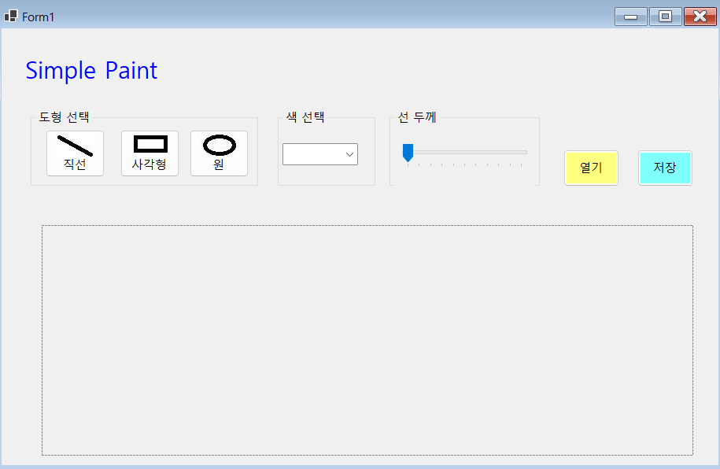

# (C# 코딩) SimplePaint

## 개요

* C# 프로그래밍 학습

* 1줄 소개: 마우스로 직선, 사각형, 원을 그리고 색상과 선 굵기를 선택할 수 있는 간단한 그림판 프로그램

* 사용한 플랫폼:

  * C#, .NET Windows Forms, Visual Studio, GitHub

* 사용한 컨트롤:

  * Label (제목 표시)
  * GroupBox (도형 선택 영역)
  * Button (직선, 사각형, 원 선택)
  * ComboBox (색상 선택)
  * TrackBar (선 굵기 조절)
  * PictureBox (그림 그리기 영역)

* 사용한 기술과 구현한 기능:

  * Visual Studio를 이용한 Windows Forms UI 구성
  * enum을 활용한 도형 선택 상태 관리 (Line, Rectangle, Circle)
  * ComboBox를 이용한 색상 선택 기능 구현
  * TrackBar를 이용한 선 굵기 조절 기능 구현
  * 마우스 이벤트(MouseDown, MouseMove, MouseUp)를 이용한 드래그 기반 도형 그리기 구현
  * Graphics 클래스와 Pen을 이용한 직선, 사각형, 원 그리기

  ## 실행 화면 (과제1) 
  - 코드의 실행 스크린샷과 구현 내용 설명 
	- 
	- 구현한 내용 (위 그림 참조) 
	-도형 선택 버튼(직선, 사각형, 원) 클릭 시 선택 상태 변경 구현
	-ComboBox를 이용한 색상 선택 기능 구현
	-TrackBar를 이용한 선 굵기 조절 기능 구현